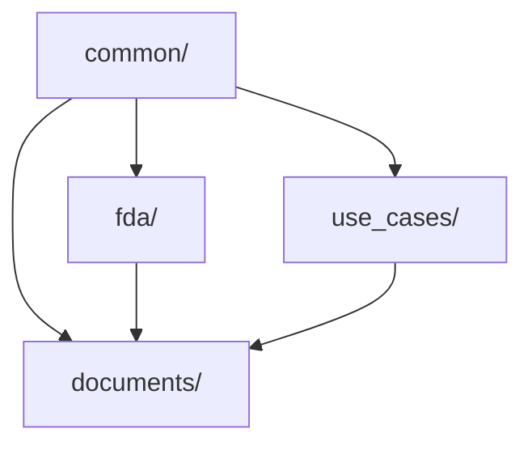

# Module Overview

AshMatics Core DataModels is organized into domain-specific modules, each serving a specific purpose in the healthcare regulatory data ecosystem.

## Module Structure

```
ashmatics_datamodels/
├── common/          # Cross-jurisdictional base models
├── fda/             # FDA-specific schemas
├── use_cases/       # Clinical AI use case taxonomy
├── documents/       # MongoDB three-tier documents
└── utils/           # Utilities (future)
```

## common/

**Purpose:** Cross-jurisdictional base models, validators, and enums

**Key Components:**
- `AshMaticsBaseModel` - Base class for all models
- `TimestampedModel` - Auto-timestamp tracking
- `AuditedModel` - Full audit trail support
- Validators for dates, country codes, FDA identifiers
- Global enums (authorization status, risk categories)
- Multi-jurisdiction regulator schemas
- Regulatory framework schemas

**Use Cases:**
- Building new data models
- Validating regulatory identifiers
- Working with multiple jurisdictions

[Learn more →](common.md)

## fda/

**Purpose:** FDA-specific vocabulary aligned with OpenFDA API

**Key Components:**
- Manufacturer schemas with contact information
- Clearance schemas (510(k), PMA, De Novo)
- Product codes and device classifications
- Product and regulatory status
- Recall information
- MAUDE adverse event reports

**Use Cases:**
- Processing OpenFDA API data
- Managing 510(k) clearances
- Tracking device recalls
- Analyzing adverse events

[Learn more →](fda.md)

## use_cases/

**Purpose:** Clinical AI use case categorization and taxonomy

**Key Components:**
- Hierarchical use case categories
- Use case definitions with evidence links
- Clinical domain and specialty enums
- Deployment model classifications

**Use Cases:**
- Organizing AI applications by clinical use
- Building use case taxonomies
- Linking products to clinical applications

[Learn more →](use_cases.md)

## documents/

**Purpose:** MongoDB three-tier document structure for kb_* collections

**Key Components:**
- Base classes for all document types
- Evidence/publication documents
- Regulatory documents (510k summaries)
- AI model cards
- Product profile cards
- Manufacturer profile cards
- Clinical use case documents

**Use Cases:**
- Storing processed documents in MongoDB
- Building knowledge base applications
- Creating searchable document repositories
- Managing structured content with metadata

[Learn more →](documents.md)

## utils/ (Planned)

**Purpose:** Parsing and normalization utilities

**Planned Components:**
- Name normalization
- Code mapping utilities
- Date parsing helpers

**Status:** Not yet implemented

## Module Dependencies



- `common/` is the foundation (no dependencies)
- `fda/` and `use_cases/` depend on `common/`
- `documents/` uses all other modules

## Import Patterns

### Direct imports
```python
from ashmatics_datamodels.fda import FDA_510kClearance
from ashmatics_datamodels.common import AshMaticsBaseModel
```

### Module-level imports
```python
from ashmatics_datamodels import fda
from ashmatics_datamodels import documents

clearance = fda.FDA_510kClearance(...)
doc = documents.EvidenceDocument(...)
```

### Package-level exports
```python
from ashmatics_datamodels import __version__
print(__version__)  # "0.2.0"
```

## Next Steps

Explore each module in detail:

- [common/](common.md) - Base models and validators
- [fda/](fda.md) - FDA vocabulary
- [use_cases/](use_cases.md) - Clinical AI taxonomy
- [documents/](documents.md) - MongoDB document schemas
